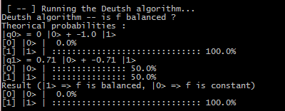

# afQuanta
afQuanta is a basic quantum computing library written in Haskell.
I don't expect this to be something really big but it does the job. Lol</br>
I hope to can get some feedbacks from you ! </br>
You are free to mail me : afmichael73@gmail.com



## QBit / QVector
* You can create a `QBit` from a `QVector`, a special kind of vector where all components are complex numbers, the input vector should be unitary.
* A qubit only takes a `2^N` vector as input

```Haskell
-- |my_qubit> = i|1>
my_qubit = qBit $ qVec [0, 0 :+ 1]

-- Say we want a qubit in the same direction as [1, 2,...8]
my_qubit' = qBit my_vec
	where
		unit   = map (\x -> x :+ 0) $ take 8 [1..]
		my_vec = qVNormalize $ qVec unit
```

You can also combine two qubit registers into a single one
```Haskell
-- |0>
psi = qBit $ qVec [1, 0]
-- |1>
phi = qBit $ qVec [0, 1]

-- |0> (X) |1> = |01>
res = psi `combine` phi -- combined state
```

## QGate / QMatrix
* You can build your own quantum gate or use predefined ones
* A gate is built using a QMatrix : a `2^N x 2^N` matrix where all components are complex numbers
* A gate should be unitary : it preserves unitary vectors

```Haskell
-- Creating a new gate
my_gate = qGate $ qMatrix [
		[1, 0],
		[0,-1]
	]
-- Applying a gate to a given state
new_state  = my_gate `apply` old_state
	where 
		old_state = qBit $ qVec [1, 0]

-- You can even compose multiple Gates
new_state' = (my_gate `gdot` hadamard2) `apply` new_state
```
All quantum gates are represented as *Hermitian* and *unitary* for energy preservation
```Haskell
-- we can extract the QMatrix data inside a QGate by using the qGateMatrix function
qIsHermitian $ qGateMatrix some_gate -- evaluates to True
qIsUnitary $ qGateMatrix some_gate -- evaluates to True
```

You can use the `U3` gate generator by using the `qGateGenerator teta phi lambda` function
```Haskell
-- For example, the hadamard gate can be obtained with ...
my_hadamard2 = qGateGenerator (pi/2) 0 pi
```

## Predefined gates
* hadamard2
* pauli_x
* pauli_y
* pauli_z
* swap_s
* toffoli
* ...etc

## Measure
In this example, we measure a qubit based on the probability of having each state
```Haskell
measured =
	let
		-- Initializing the register state
		-- |psi> = 1*|0> + 0*|1>
		psi    = qBit $ qVec [1, 0]

		-- Applying the Hadamard gate
		-- H |psi> = 1/sqrt 2  (|0> + |1>)
		result = hadamard2 `apply` psi
	in
		qObserve result
```
## Basic operations
```Haskell
vec   = qVec [1 :+ 1, 5] -- [1 + i, 5]
u_vec = qVNormalize vec -- unit vector
len   = qVLength u_vec -- evaluates to 1
res_d = vec `vdot` qVec [0, 1] -- dot product

reg   = qBit u_vec -- creating a qubit from a vector
obsr  = qObserve reg -- observing the state

a = qMat [[1, 1], [2,2]]
b = qMat [[3, 3], [4,4]]

is_zero  = qIsZero $ qMat [[0, 0], [0,0]] -- evaluates to True

h_matrix = qGateMatrix hadamard2 -- extracts the QMatrix inside the hadamard2 gate
temp     = qIsHermitian h_matrix -- evaluates to True
temp'    = qIsUnitary h_matrix -- evaluates to True
temp''   = qIsZero h_matrix -- evaluates to False
 
-- Conjugate Transpose/adjoint matrix/ Matrix^dagger
conj_trans = qConjugateTranspose a

-- Transpose / Matrix^T
a_transp = qTranspose a

-- Product between two matrices
matr_prod = a `dot` b

-- Product between a Float number and a matrix
floa_prod = 3 `times` a

-- Product between a complex number and a matrix
comp_prod = (1 :+ 1) `ctimes` a

-- Product between a matrix and a vector
matv_prod = a `mtimes` vec

-- Gate composition
new_gate  = (qGate a) `gdot` (qGate b)

-- Tensor product between two matrices
tens_prod = a `kprod` b

-- Tensor product between two quantum gates
gt_prod   = (qGate a) `tprod` (qGate b)

-- Tensor product between two quBits
-- |0> (X) |1> = |01>
combined  = (qBit $ qVec [1, 0]) `combine` (qBit $ qVec [0, 1])
```
## Program example
```Haskell
module Main where
import Data.Complex
import QVector
import QMatrix
import QBit
import QGate

main :: IO ()
main = 
	let
		-- Initializing
		psi   = qBit $ qVec [1, 0] -- first qubit register
		phi   = qBit $ qVec [0, 1] -- second qubit register

		-- |S> = |psi> (X) |phi>
		state = psi `combine` phi

		-- adapting the hadamard gate for N = 4
		h4 = hadamard2 `tprod` hadamard2

		-- Applying the Hadamard gate
		result   = h4 `apply` state
		measured = qObserve result 
	in
		do
			putStrLn $ "|S> = " ++ show state
			putStrLn $ "H |S> = " ++ show result
			putStrLn $ "mes H|S> : \n" ++ show measured
```